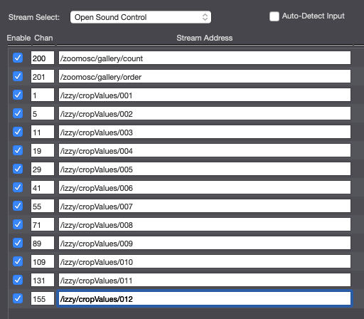
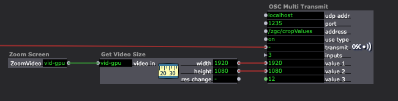
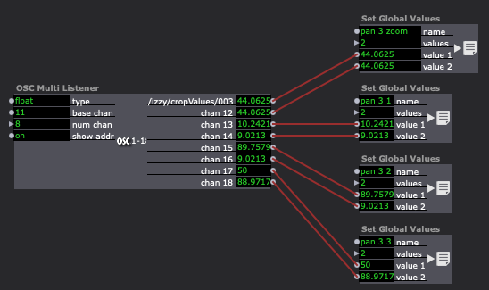

# zoom-gallery-crop

This tool calculates the sizes and locations of the boxes in a Zoom gallery. It responds with an OSC message
intended for Isadora to set Panners. You can listen to the responses from any OSC client, and it's not too
hard to modify to make it do other things with the results of the calculations if you want to do a little coding.

Feel free to fork/improve and I'll be happy to merge back in.

You need [nodejs](https://nodejs.org/en/) installed to build and use it.

## Requirements

- [ZoomOSC](https://www.liminalet.com/zoomosc)
- [Isadora](https://troikatronix.com/)

## To Run

### tl;dr (for Mac)

1. Have [nodejs](https://nodejs.org/en/) installed.
2. Double-click `START.command`
3. Get to work

### Manually run with npm

```
npm install
```

```
npm start
```

## To Setup

By default, this app listens to port 1235 on all network devices, so you should be able to reach it
from other computers. If you want to change the host or port of the listener, you can set
global variables `LISTEN_HOST` and `LISTEN_PORT`.

If Isadora is listening to a different port than the default 1234, or on a different host machine,
you can set `IZZY_HOST` and `IZZY_PORT`.

In Isadora, go to `Communications -> Stream Setup...` and set up your ports for all the numbers of
gallery boxes you need. You will aos need to care about `/zoomosc/gallery/count` and `/zoomosc/gallery/order` 
messages.



You'll want to trigger the calculations from Isadora with the size of the screen. Here's how I do it:



And then a bunch of listeners to get all the possible crop sizes which you can store away in Global Vars.
Here's my listener for the 3-person gallery values:



Notice the naming convention. It's easy to construct names to pull the right value when you construct names
that are unique per number of boxes and number for each box.


## Commands

There's really just one command that Isadora needs to send:

/zgc/cropValues

